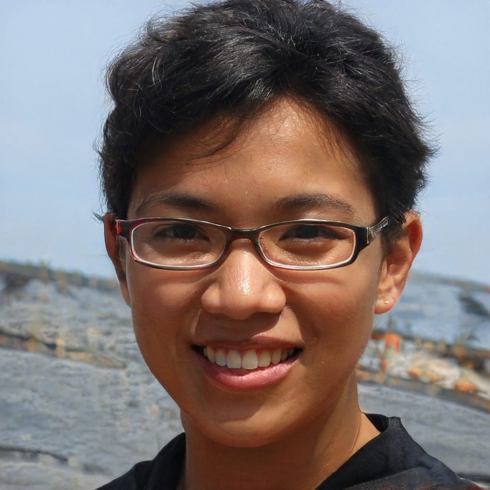
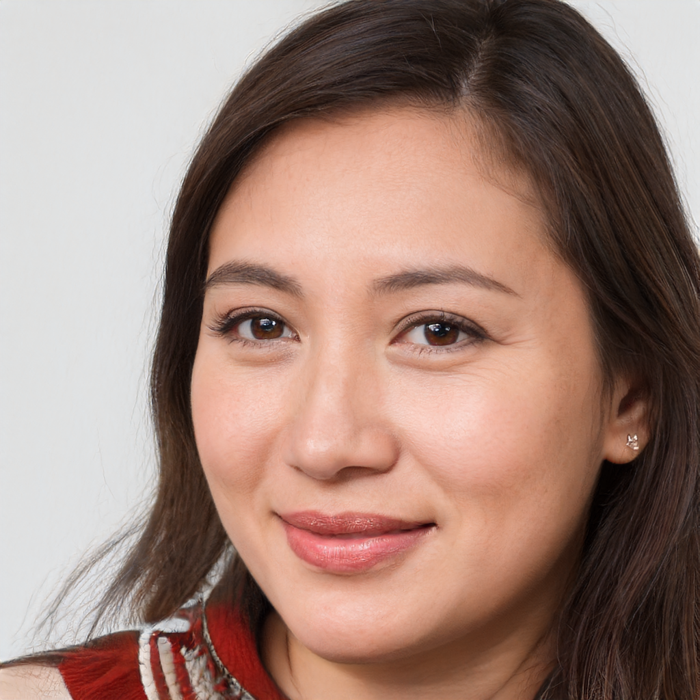

# GAN Image Generation with StyleGAN2-ADA

This project explores how Generative Adversarial Networks (GANs), using **StyleGAN2-ADA**, can generate realistic images from random noise using a pretrained model trained on the FFHQ (Flickr-Faces-HQ) dataset.

## Objective

- Understand how GANs work by interacting with pretrained models.
- Generate synthetic images from random noise vectors.
- Analyze and reflect on how changes to input vectors influence the image output.

## About GANs

Generative Adversarial Networks consist of two models:
- **Generator**: Produces fake images from noise.
- **Discriminator**: Tries to distinguish real from generated images.

The two models train adversarially, improving each other over time. In this project, I used a pretrained generator model to focus on inference and analysis.

## Tools & Libraries

- Python
- PyTorch
- Google Colab / Jupyter Notebook
- `torch`, `matplotlib`, `PIL`, `dnnlib`, `legacy`

## How to Run

1. **Clone and install required libraries**:
    ```bash
    git clone https://github.com/NVlabs/stylegan2-ada-pytorch.git
    cd stylegan2-ada-pytorch
    pip install -r requirements.txt
    pip install ninja
    ```

2. **Download the pretrained model**:
    ```bash
    wget https://nvlabs-fi-cdn.nvidia.com/stylegan2-ada-pytorch/pretrained/ffhq.pkl
    ```

3. **Run the notebook** (`gan_image_generation.ipynb`):
    - Open in Jupyter or Google Colab.
    - Generate images using random 512-dimensional latent vectors.
    - Experiment with different seeds or truncation values.

4. **Customize**:
    - Adjust the latent vector.
    - Modify truncation values or generate and save multiple images.
    - Save images using PIL.

## Preview Generated Faces

Here are sample images generated using the pretrained StyleGAN2-ADA model:

<p align="center">
  
  
  
  
  
</p>

## Reflection Report

- Introduction to GANs
- Summary of the experiment
- Observations on image quality and variation
- Reflections on challenges, limitations, and learnings

## Deliverables

- Jupyter Notebook (`gan_image_generation.ipynb`)
- Reflection Report (`GANs Reflection.pdf`)
- Generated images (`face_1.png`, `face_2.png`, etc.)